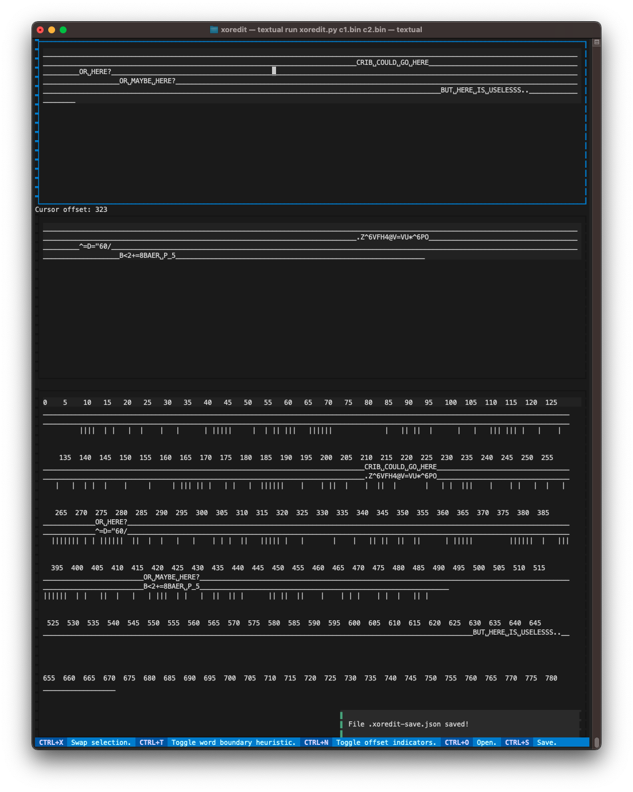

## XOREdit

When two plaintexts are encrypted using an XOR operation with a repeated keystream, a relation between the two ciphertexts exists: computing the XOR of the two ciphertexts cancels out the key stream. The result is the XOR of the original plaintexts.

By guessing so-called '[cribs](https://en.wikipedia.org/wiki/Known-plaintext_attack)' in either of the two plaintexts, the XOR relation lets us uncover fragments of the other plaintext. Going back and forth between the plaintexts, we can slowly piece together the entire text. This is a somewhat tedious process.

The tool in this repository provides an interactive user interface to streamline the manual labor (somewhat).



### Getting started

The tool was built using [Textualize](https://www.textualize.io). Install it directly, or using the `requirements.txt` file.

```
pip install textual
```

Start the tool by passing commandline arguments, specifying the file names of the two ciphertexts (as binary data).

```
python xoredit.py c1.bin c2.bin
```

### Features

- XOR operation fully supported!
- Offsets, to be able to talk about plaintext positions.
- Saving and loading the plaintext state.
- Swapping text fragments between the plaintexts.
- Heuristically marking potential word boundaries.
- 🎮 Hotseat multiplayer mode (i.e., hook it up to a big screen and have people shout suggestions).

### TODO's

- Being able to 'drag' cribs along the plaintext. Use external tooling for now.
- Dictionary integration, to suggest cribs at likely locations.
